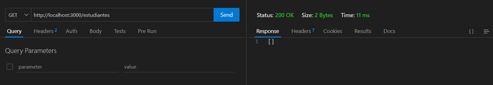
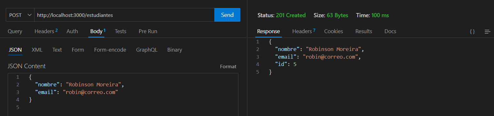
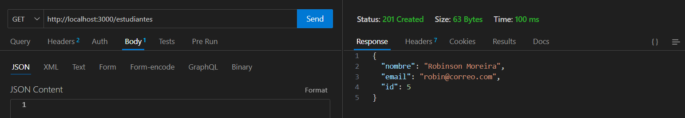
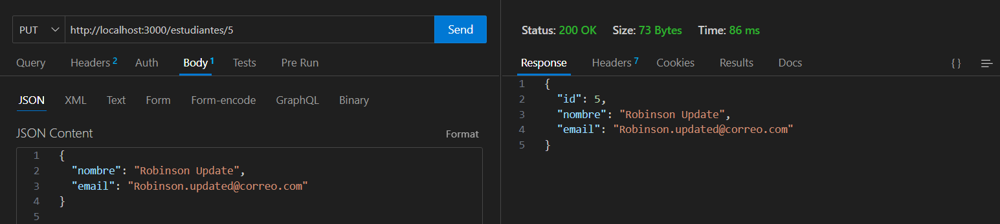
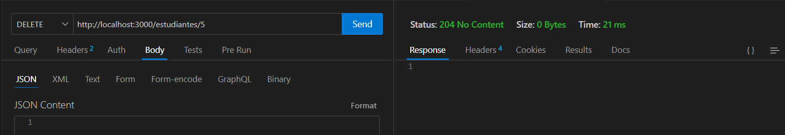
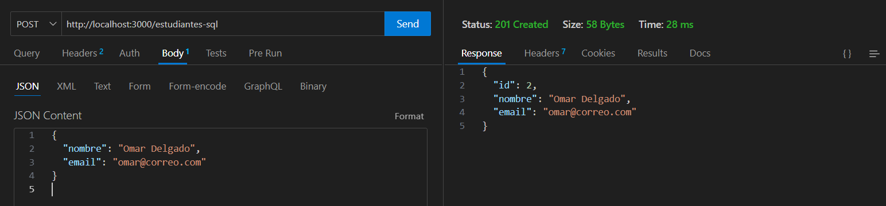
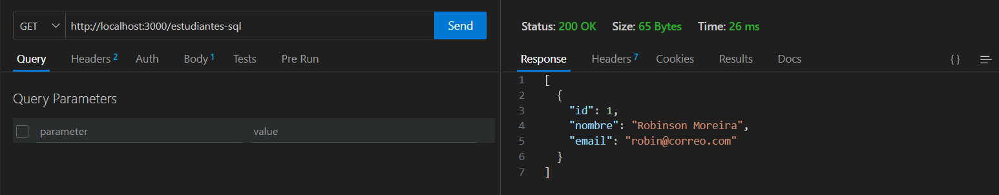
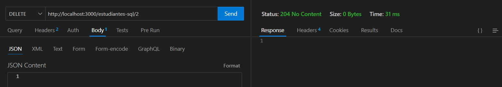

# 📘 Práctica 3 – Arquitectura N-Capas con TypeORM y Sequelize

Este proyecto implementa la práctica 3 de la materia Aplicaciones para el Servidor Web.  
Se utiliza la arquitectura en N capas y se expone una API REST desarrollada con Node.js, TypeScript y Express.

---

## 📁 Estructura del proyecto

```text
practica3/
├── evidencia/
│   ├── get-vacio.png
│   ├── post-estudiante.png
│   ├── ...
├── src/
│   ├── config/
│   ├── domain/
│   ├── application/
│   ├── infrastructure/
│   │   ├── datasource/
│   │   │   ├── typeorm/
│   │   │   └── sequelize/
│   │   ├── models/
│   │   └── repositories/
│   ├── presentation/
│   │   ├── controllers/
│   │   └── routes/
│   └── main.ts
├── package.json
├── tsconfig.json
└── README.md
```

---

## 🧱 Entidades implementadas

Se implementó la entidad Estudiante utilizando dos ORMs distintos:

- 🟢 TypeORM → ORM principal para la mayoría de funcionalidades
- 🟠 Sequelize → ORM alternativo implementado en paralelo

Ambos ORMs interactúan con la misma base de datos MySQL, pero con tablas distintas.

---

## ⚙️ Instalación

1. Instalar las dependencias desde PRIMER PARCIAL:

```bash
npm install
```

2. Crear la base de datos en MySQL:

```sql
CREATE DATABASE practica3;
```

3. Verificar las credenciales en:

📄 src/config/envs.ts

```ts
export const envs = {
  PORT: process.env.PORT || 3000,
  DB_NAME: process.env.DB_NAME || "practica3",
  DB_USER: process.env.DB_USER || "root",
  DB_PASS: process.env.DB_PASS || "admin123", ← ajusta según tu entorno
  DB_HOST: process.env.DB_HOST || "localhost",
  DB_PORT: Number(process.env.DB_PORT) || 3306,
};
```

---

## 🚀 Ejecutar el servidor

```bash
npm run dev:p3
```

El servidor se levantará en:

- TypeORM → http://localhost:3000/estudiantes  
- Sequelize → http://localhost:3000/estudiantes-sql

---

## 🔊 Endpoints disponibles

### Rutas con TypeORM (/estudiantes)
- `GET /estudiantes` – Listar todos
- `POST /estudiantes` – Crear
- `PUT /estudiantes/:id` – Actualizar
- `DELETE /estudiantes/:id` – Eliminar

### Rutas con Sequelize (/estudiantes-sql)
- `GET /estudiantes-sql`
- `POST /estudiantes-sql`
- `PUT /estudiantes-sql/:id`
- `DELETE /estudiantes-sql/:id`

---

## 📷 Evidencias de funcionamiento

A continuación se muestran las capturas de las pruebas realizadas con Thunder Client:

### 🔹 1. GET sin registros


### 🔹 2. POST creando estudiante


### 🔹 3. GET con registro nuevo


### 🔹 4. PUT actualizando estudiante


### 🔹 5. DELETE eliminando estudiante


### 🔹 6. POST creando estudiante con Sequelize


### 🔹 7. GET con registro Sequelize


### 🔹 8. DELETE estudiante Sequelize


---

## ✅ Tecnologías utilizadas

- TypeScript
- Node.js
- Express
- TypeORM
- Sequelize + sequelize-typescript
- MySQL
- Thunder Client (cliente de pruebas)

---

## ✍️ Autor

🧑‍💼 Tu Nombre Aquí  
📚 Materia: Aplicaciones para el Servidor Web  
🗓️ Práctica 3 – Primer Parcial
